<h1 align="center"> Yuminos </h1>

<p align="center">
  <a href="https://github.com/Yu-Leo/hugo-theme-yuminos/blob/main/LICENSE" target="_blank"> </a>
  <a href="https://github.com/Yu-Leo/hugo-theme-yuminos/releases/latest" target="_blank"> </a>
  <a href="https://github.com/Yu-Leo/hugo-theme-yuminos/commits/main" target="_blank"> </a>
  <a href="https://github.com/Yu-Leo/hugo-theme-yuminos/graphs/contributors" target="_blank"> </a>
</p>

**[Yuminos](https://github.com/Yu-Leo/hugo-theme-yuminos)** - минималистичная и функциональная тема для генератора статических сайтов [Hugo](https://gohugo.io/).

Основана на теме [Minos](https://github.com/carsonip/hugo-theme-minos) и дизайне [сайта](https://devpew.com/) Дмитрия Ковалёва.

Демонстрация темы: https://yu-leo.github.io/yu0dev/

## ❗Дисклеймер

1. Проект находится в стадии разработки. **Может содержать ошибки** и недочеты как в UI/UX, так и в реализации задуманного: "костыли", не оптимальные решения, дублирование кода, некрасивый код и т. д. и т. п. [Issues](https://github.com/Yu-Leo/hugo-theme-yuminos/issues) с замечаниями и предложениями, а так же [Pull Requests](https://github.com/Yu-Leo/hugo-theme-yuminos/pulls) с исправлениями приветствуются!
2. Корректное **отображение** и функционирование **table of content** при включении данной опции в конфиге **не гарантируется!**

## 🗿 Философия темы

- Минималистичность дизайна
- Контент первичен. Оформление темы не должно мешать его восприятию
- Широкие возможности для авторов контента важны

## 🖼 Скриншоты

**Главная страница**

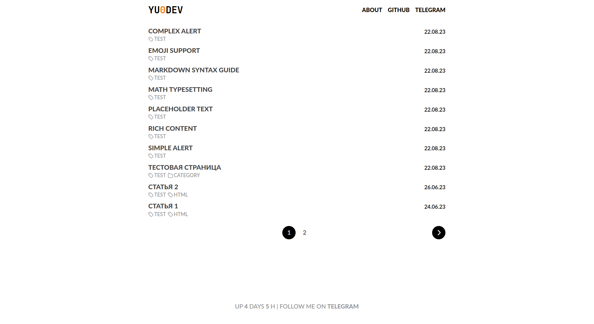

**Страница тега**

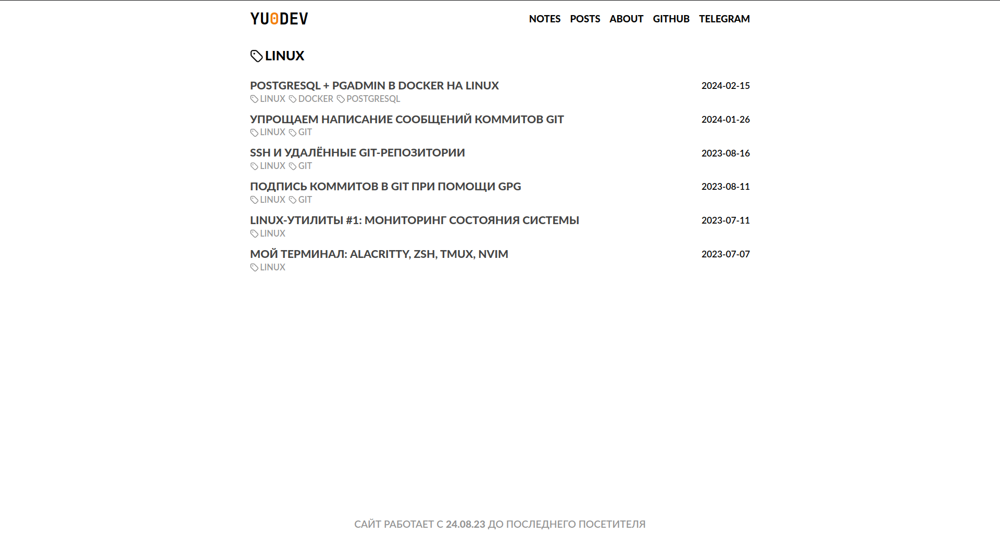

**Страница статьи**

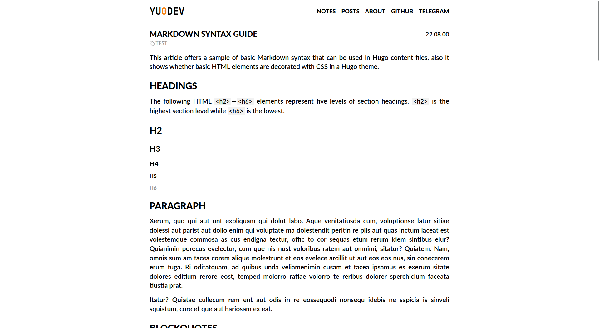

## 🔨 Установка

Для того чтобы установить тему **Yuminos**:

1. Склонируйте этот репозиторий в директорию `themes/` Вашего сайта:

```shell
git clone https://github.com/Yu-Leo/hugo-theme-yuminos
```

либо добавьте его как подмодуль, если в директории с Вашим сайтом инициализирован git-репозиторий:

```shell
git submodule add https://github.com/Yu-Leo/hugo-theme-yuminos
```

2. Укажите название темы в конфигурационном файле. По умолчанию - в файле `hugo.toml` в директории Вашего сайта:

```toml
theme = "hugo-theme-yuminos"
```

## ⬆ Обновление

Если тема была установлена как git-подмодуль, обновить её можно следующим образом:

```shell
git submodule update --remote themes/hugo-theme-yuminos
```

## ⭐ Возможности

### Пагинация

Используется на страницах, содержащих списки постов: главная страница, страницы тегов и категорий.

```toml
paginate = 50
```

### KaTeX

В теме присутствует поддержка отображения `TeX` вёрстки при помощи [KaTeX](https://github.com/KaTeX/KaTeX). Включить либо отключить рендеринг можно в соответствующем параметре в конфиге:

```toml
[params]  
  katex = true
```

<details>

<summary>Скриншот</summary>

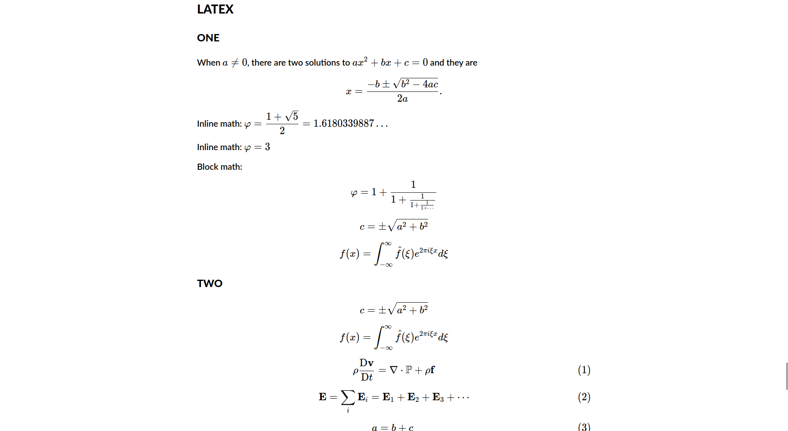

</details>

- Inline верстка должна обрамляться последовательностями `\\(` и `\\)`.
- Отдельные блоки, выравниваемые по центру, - последовательностями `$$`
- Дополнение [copy-tex](https://github.com/KaTeX/KaTeX/tree/main/contrib/copy-tex) заменяет отрендеренные фрагменты на исходную TeX-верстку при выделении и копировании
- Поддерживаемые операции: https://katex.org/docs/supported.html
- Простой TeX редактор: https://latexeditor.lagrida.com/
### Блоки кода

Все блоки кода содержат кнопку "копировать", по нажатию на которую содержимое соответствующего блока копируется в буфер обмена. Вне зависимости от того, оформлены блоки кода в разметке Markdown или добавлены при помощи Hugo shortcodes.

Тема Yuminos подразумевает использование цветовой схемы `gruvbox` для блоков кода. Цвета кнопки копирования взяты из её палитры. Тема содержит встроенные стили для блоков кода (highlight-style.css), основанные на теме `gruvbox`.

Рекомендуется установить следующие настройки:

```toml
[markup]
  defaultMarkdownHandler = 'goldmark'
  [markup.goldmark]
    [markup.goldmark.renderer]
      unsafe = true
    [markup.goldmark.extensions]
      highlight = true
  [markup.highlight]
    tabWidth = 4
    lineNumbersInTable=false
    noClasses=false
```

<details>

<summary>Скриншот</summary>

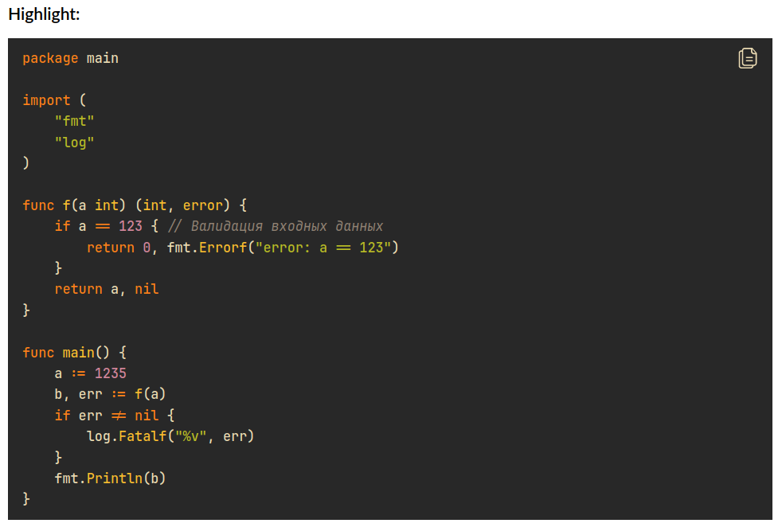

</details>

#### Shell

Если в качестве языка для блока с кодом указан `shell`, то к каждой строке такого блока будет добавлен символ "$". Он не будет выделяться курсором вместе с остальным текстом, а так же не будет копироваться в буфер обмена при нажатии кнопки копирования. Эту фичу можно использовать для оформления запускаемых из терминала команд.

<details>

<summary>Скриншот</summary>

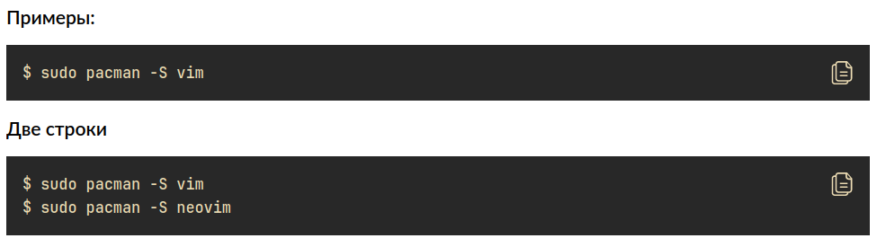

</details>

#### Diff

Встроенные стили для блоков кода ([highlight-style.css](./static/css/highlight-style.css)) имеют кастомное оформление для языка `diff`:

<details>

<summary>Исходный код</summary>

```
diff --git a/.signer2.go b/.signer2.go
var hello = function() {
-  return "hello";
+  return "hello world";
}

!strong text
text
@subheading
Index asdfasdf
= asfdasfasfd
```

</details>

<details>

<summary>Скриншот</summary>

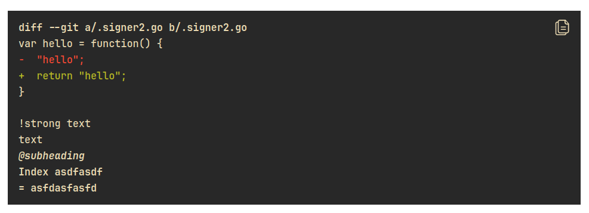

</details>

#### Highlight shortcode

[Документация](https://gohugo.io/content-management/syntax-highlighting/). [Справка](https://www.veriphor.com/articles/code-block-render-hooks/)

❗ Опция `lineNos=table` имеет некорректное отображение. Рекомендуется использовать `lineNos=inline`

### Мета-теги

Для улучшения SEO шаблоны темы содержат мета-теги. Значения тегов `title`, `description` и `keywords` берутся из параметров поста. При отсутствии в параметрах поста - из конфигурационного файла сайта.

#### Для всего сайта

Значения задаются в конфигурационном файле:

```toml
[params]
  description = "Site description"
  keywords = ["keyword1", "keyword2"]
  [params.author]
    name = "Author name"
```
#### Для конкретного поста

Значения задаются в параметрах поста:

```
---
title: "Тестовая страница"
description: "Это тестовая страница, демонстрирующая возможности темы"
keywords: ["keyword1", "keyword2"]
---
```

#### Open Graph

Присутствует поддержка мета-тегов Open Graph: `og:title`, `og:description`, `og:type`, `og:url`.

### Комментарии. Giscus

Присутствует интеграция с системой комментариев [giscus](https://giscus.app/ru).

Настройки в конфигурационном файле:

```toml
[params]
  [params.comments]
    enabled = true
  [params.comments.giscus]
      repo = "repo-name"
      repoID = "repo-id"
      category = "category-name"
      categoryID = "category-id"
      mapping = "title"
      reactionsEnabled = 1
      emitMetadata = 0
      lazy = false
      lang = "en"
```

Для каждого поста можно отдельно отключить комментарии в его параметрах:

```
---
comments: false
---
```

### Яндекс.Метрика

Присутствует интеграция с сервисом [Яндекс.Метрика](https://metrika.yandex.ru/promo/product).

Настройки в конфигурационном файле:
```toml
[params]
  yandexMetrikaId = "1234567890"
```

### Alerts

К каждому посту можно добавить алёрт, который будет отображаться перед его содержимым.

Для этого нужно указать в параметрах поста следующие строки:

```yaml
---
page:
  alert:
    message: "Содержимое алёрта. Можно использовать **Markdown**"
    type: "danger"
---
```

Типы алёртов:
- `info` (синий)
- `success` (зелёный)
- `danger` (красный)

Если Вам нужен информационный алёрт, можно использовать сокращённую форму:

```yaml
---
page:
  alert: "Информационный алерт"
---
```

<details>

<summary>Скриншоты</summary>

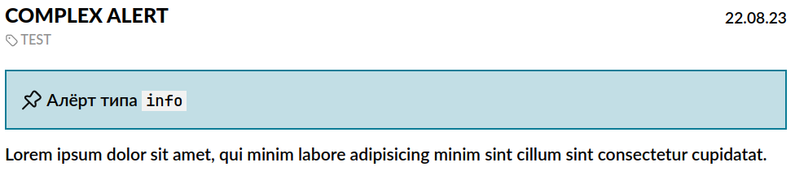


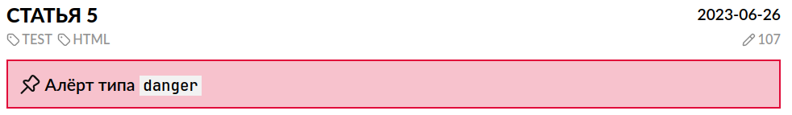

</details>

### Блоки ToDo 

Полезны, если в процессе написания поста Вы хотите оставить какие-либо заметки на будущее и не забыть удалить их перед публикацией.

Все ToDo-блоки, содержащиеся в посте, автоматически будут подсчитаны. В начале поста будет отображаться алёрт с их количеством, если оно больше 0.

#### Блок с содержимым

Добавляется в пост следующим образом:

```markdown

Содержимое блока ToDo. Можно использовать **Markdown**

```

#### Блок без содержимого

Добавляется в пост следующим образом:

```markdown

```

<details>

<summary>Скриншоты</summary>

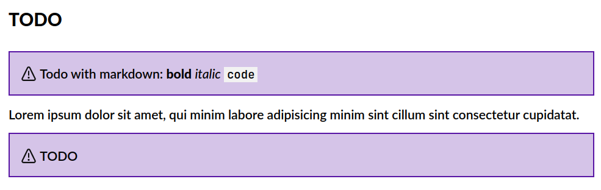

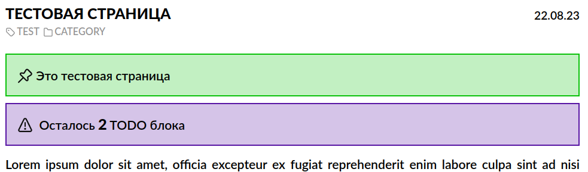

</details>

### Скрытые блоки

Синтаксис:

<details>

<summary>Исходный код</summary>

```html
<details>
<summary>Подробнее</summary>

## Скрытый блок

Lorem ipsum dolor sit amet, officia excepteur ex fugiat reprehenderit enim labore culpa sint ad nisi Lorem pariatur mollit ex esse exercitation amet. Nisi anim cupidatat excepteur officia. Reprehenderit nostrud nostrud ipsum Lorem est aliquip amet voluptate voluptate dolor minim nulla est proident. Nostrud officia pariatur ut officia. Sit irure elit esse ea nulla sunt ex occaecat reprehenderit commodo officia dolor Lorem duis laboris cupidatat officia voluptate. Culpa proident adipisicing id nulla nisi laboris ex in Lorem sunt duis officia eiusmod. Aliqua reprehenderit commodo ex non excepteur duis sunt velit enim. Voluptate laboris sint cupidatat ullamco ut ea consectetur et est culpa et culpa duis.

> Цитата
</details>
```

</details>

<details>

<summary>Скриншот (блок скрыт)</summary>

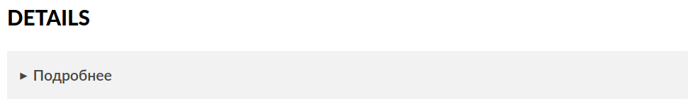

</details>

<details>

<summary>Скриншот (блок открыт)</summary>

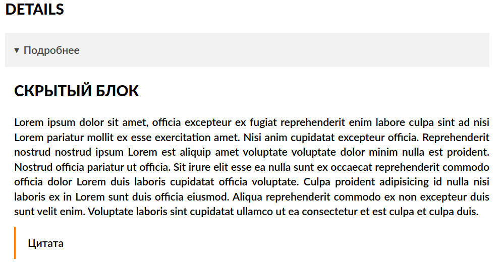

</details>

### Goat

Присутствует поддержка [Goat](https://github.com/blampe/goat).

<details>

<summary>Исходный код</summary>

```goat
      .               .                .               .--- 1          .-- 1     / 1
     / \              |                |           .---+            .-+         +
    /   \         .---+---.         .--+--.        |   '--- 2      |   '-- 2   / \ 2
   +     +        |       |        |       |    ---+            ---+          +
  / \   / \     .-+-.   .-+-.     .+.     .+.      |   .--- 3      |   .-- 3   \ / 3
 /   \ /   \    |   |   |   |    |   |   |   |     '---+            '-+         +
 1   2 3   4    1   2   3   4    1   2   3   4         '--- 4          '-- 4     \ 4
```

</details>

<details>

<summary>Скриншот</summary>

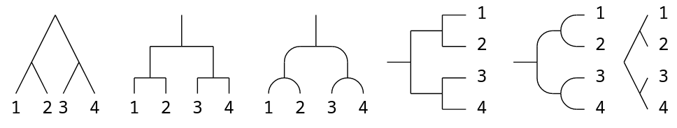

</details>

### StartTime

Если данная опция включена, в футере будет выводиться `startTime` - дата, с которой работает сайт.

```toml
[params]
    startTime = "2023-08-24T10:00:00"
```

<details>

<summary>Скриншот</summary>

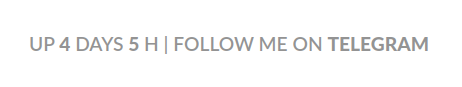

</details>

### Thinkpad-like кнопки

Если данная опция включена, обрамленные тегом `<kbd>...</kbd>` символы будут иметь стиль, схожий со стилем кнопок на клавиатурах ноутбуков Lenovo Thinkpad.

```toml
[params]
  thinkpadKbd = true
```

<details>

<summary>Скриншот</summary>

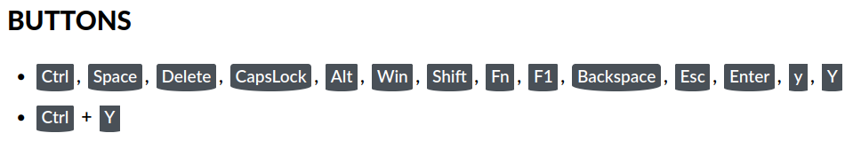

</details>

Обычный вид кнопок (опция выключена):

<details>

<summary>Скриншот</summary>

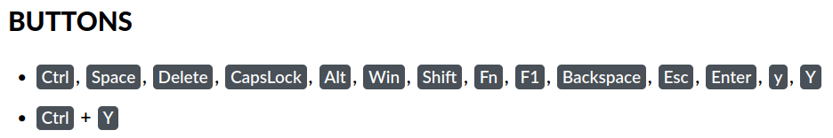

</details>

### Кастомное название сайта

По умолчанию в левом углу хэдера сайта будет отображаться содержимое параметра `title` из конфигурационного файла.

Если вы хотите использовать кастомное название сайта с собственными стилями, включите соответствующую настройку в конфигурационном файле:
```toml
[params]
  customTitle = true
```
в таком случае на место названия сайта будет подставлено содержимое файла `layouts/partials/custom-title.html`.

## 🎨 UI

### Шрифты

Основной текст: **Lato**

Моноширинный текст: **JetBrains Mono**

### Цветовая палитра

На данный момент тема содержит **только светлое оформление**, основанное на следующей цветовой палитре:

- Белый: `#ffffff` - фоновый цвет
- Черный: `#000000` - основной цвет текста
- Оттенки серого: 
  - `#939393` - иконки и названия тегов и категорий, иконки ссылки в заголовках в постах, текст в футере сайта
  - `#f2f2f2` - фон для inline-кода
  - `#495057` - фон для клавиш
  - `#444444` - ссылки и заголовки постов в списках
- Оранжевый: `#F37E0C` - основной контрастный цвет
- Синий: `#0C7C96` - алёрт типа `info`
- Зелёный: `#0AC20A` - алёрт типа `success`
- Красный: `#E10B39` - алёрт типа `danger`
- Фиолетовый: `#5815A4` - ToDo блоки и алёрты

### Иконки

В интерфейсе используются иконки из [коллекции](https://www.svgrepo.com/collection/gentlecons-interface-icons/).

## 📝 Лицензия

- Автор темы **Minos** для [Hexo](https://hexo.io/ru/): [@ppoffice](https://github.com/ppoffice)
- Порт для Hugo: [@carsonip](https://github.com/carsonip)
- Дополнения: [@devpew](https://github.com/devpew)
- Автор темы **Yuminos**: [@Yu-Leo](https://github.com/yu-leo)

Проект разрабатывается под лицензией **MIT**. Полный текст - в файле [LICENSE](https://github.com/Yu-Leo/hugo-theme-yuminos/blob/main/LICENSE). 